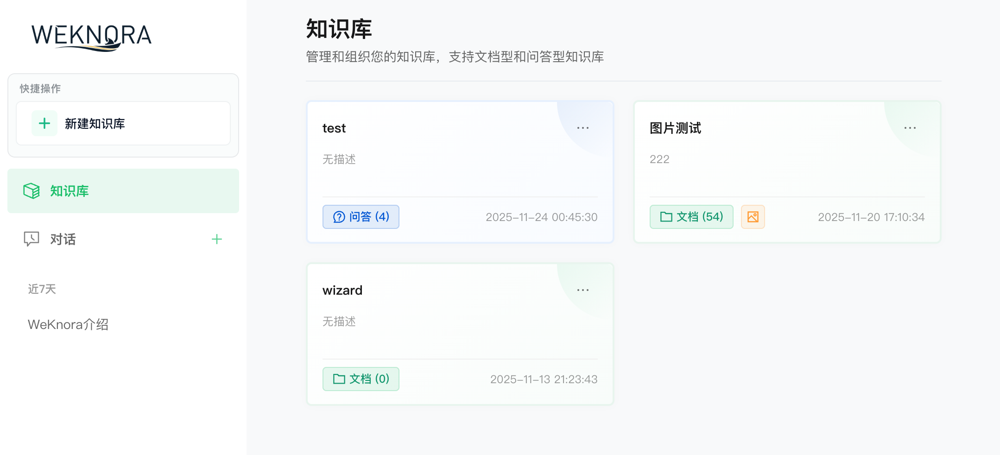
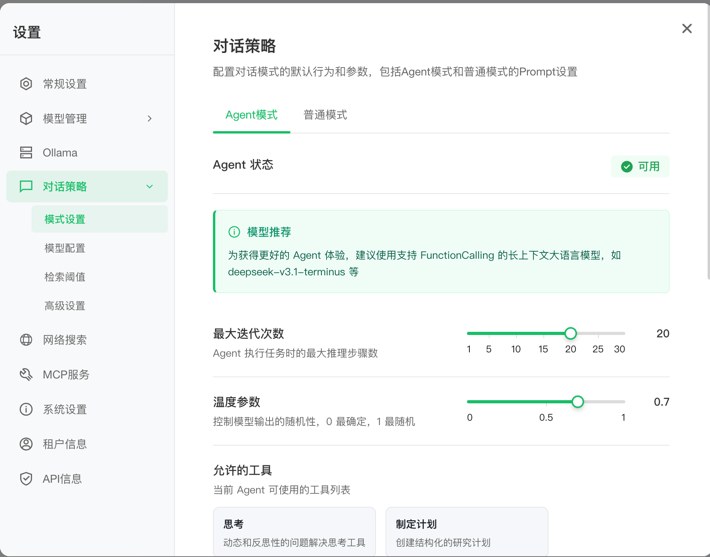
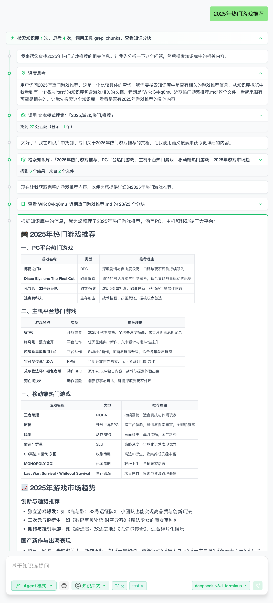

<p align="center">
  <picture>
    
  </picture>
</p>

<p align="center">
  <picture>
    <a href="https://trendshift.io/repositories/15289" target="_blank">
      
    </a>
  </picture>
</p>
<p align="center">
    <a href="https://weknora.weixin.qq.com" target="_blank">
        
    </a>
    <a href="https://chatbot.weixin.qq.com" target="_blank">
        
    </a>
    <a href="https://github.com/Tencent/WeKnora/blob/main/LICENSE">
        
    </a>
    <a href="./CHANGELOG.md">
        
    </a>
</p>

<p align="center">
| <a href="./README_EN.md"><b>English</b></a> | <b>한국어</b> |
</p>

<p align="center">
  <h4 align="center">

  [개요](#-개요) • [아키텍처](#-아키텍처) • [주요 기능](#-주요-기능) • [시작하기](#-시작하기) • [API 레퍼런스](#-api-레퍼런스) • [개발자 가이드](#-개발자-가이드)

  </h4>
</p>

# 💡 WeKnora - LLM 기반 문서 이해 및 검색 프레임워크

## 📌 개요

[**WeKnora**](https://weknora.weixin.qq.com)는 심층 문서 이해와 시맨틱 검색을 위해 설계된 LLM 기반 프레임워크로, 특히 복잡하고 이질적인 문서를 처리하는 데 특화되어 있습니다.

멀티모달 전처리, 시맨틱 벡터 인덱싱, 지능형 검색, 대규모 언어 모델 추론을 결합한 모듈식 아키텍처를 채택하고 있습니다. 핵심적으로 WeKnora는 **RAG (Retrieval-Augmented Generation)** 패러다임을 따르며, 관련 문서 청크와 모델 추론을 결합하여 고품질의 컨텍스트 인식 답변을 제공합니다.

**웹사이트:** https://weknora.weixin.qq.com

## ✨ 최신 업데이트

**v0.2.0 주요 변경사항:**

- 🤖 **에이전트 모드**: 내장 도구, MCP 도구, 웹 검색을 호출할 수 있는 새로운 ReACT 에이전트 모드 추가. 여러 번의 반복과 성찰을 통해 종합적인 요약 보고서 제공
- 📚 **다중 유형 지식 베이스**: FAQ 및 문서 지식 베이스 유형 지원, 폴더 가져오기, URL 가져오기, 태그 관리, 온라인 입력 등 새로운 기능 추가
- ⚙️ **대화 전략**: 에이전트 모델, 일반 모드 모델, 검색 임계값, 프롬프트 설정 지원으로 다중 턴 대화 동작을 정밀하게 제어
- 🌐 **웹 검색**: 확장 가능한 웹 검색 엔진 지원, 기본 DuckDuckGo 검색 엔진 내장
- 🔌 **MCP 도구 통합**: MCP를 통한 에이전트 기능 확장 지원, uvx 및 npx 런처 내장, 다중 전송 방식 지원
- 🎨 **새로운 UI**: 에이전트 모드/일반 모드 전환, 도구 호출 과정 표시, 종합적인 지식 베이스 관리 인터페이스 업그레이드로 최적화된 대화 인터페이스
- ⚡ **인프라 업그레이드**: MQ 비동기 작업 관리 도입, 자동 데이터베이스 마이그레이션 및 빠른 개발 모드 지원

## 🔒 보안 공지

**중요:** v0.1.3부터 WeKnora는 시스템 보안 강화를 위한 로그인 인증 기능을 포함합니다. 프로덕션 배포 시 다음을 강력히 권장합니다:

- 공용 인터넷이 아닌 내부/프라이빗 네트워크 환경에 WeKnora 서비스 배포
- 잠재적 정보 유출 방지를 위해 서비스를 공용 네트워크에 직접 노출하지 않음
- 배포 환경에 적절한 방화벽 규칙 및 접근 제어 구성
- 보안 패치 및 개선을 위해 정기적으로 최신 버전으로 업데이트

## 🏗️ 아키텍처


WeKnora는 문서 이해 및 검색 파이프라인을 완성하기 위해 현대적인 모듈식 설계를 채택합니다. 시스템은 주로 문서 파싱, 벡터 처리, 검색 엔진, 대규모 모델 추론을 핵심 모듈로 포함하며, 각 구성 요소는 유연하게 구성 및 확장할 수 있습니다.

## 🎯 주요 기능

- **🤖 에이전트 모드**: 내장 도구를 사용하여 지식 베이스 검색, MCP 도구, 웹 검색 도구로 외부 서비스에 접근할 수 있는 ReACT 에이전트 모드 지원. 여러 번의 반복과 성찰을 통해 종합적인 요약 보고서 제공
- **🔍 정밀한 이해**: PDF, Word 문서, 이미지 등에서 구조화된 콘텐츠를 추출하여 통합된 시맨틱 뷰로 변환
- **🧠 지능형 추론**: LLM을 활용하여 문서 컨텍스트와 사용자 의도를 이해하고 정확한 Q&A 및 다중 턴 대화 제공
- **📚 다중 유형 지식 베이스**: FAQ 및 문서 지식 베이스 유형 지원, 폴더 가져오기, URL 가져오기, 태그 관리, 온라인 입력 기능
- **🔧 유연한 확장**: 파싱, 임베딩, 검색, 생성까지 모든 구성 요소가 분리되어 손쉬운 커스터마이징 가능
- **⚡ 효율적인 검색**: 키워드, 벡터, 지식 그래프를 결합한 하이브리드 검색 전략, 교차 지식 베이스 검색 지원
- **🌐 웹 검색**: 확장 가능한 웹 검색 엔진 지원, 기본 DuckDuckGo 검색 엔진 내장
- **🔌 MCP 도구 통합**: MCP를 통한 에이전트 기능 확장 지원, uvx 및 npx 런처 내장, 다중 전송 방식 지원
- **⚙️ 대화 전략**: 에이전트 모델, 일반 모드 모델, 검색 임계값, 프롬프트 설정 지원으로 다중 턴 대화 동작을 정밀하게 제어
- **🎯 사용자 친화적**: 기술적 장벽 없이 직관적인 웹 인터페이스와 표준화된 API 제공
- **🔒 안전하고 제어 가능**: 로컬 배포 및 프라이빗 클라우드 지원으로 완전한 데이터 주권 보장

## 📊 활용 시나리오

| 시나리오 | 응용 분야 | 핵심 가치 |
|---------|----------|----------|
| **기업 지식 관리** | 내부 문서 검색, 정책 Q&A, 운영 매뉴얼 검색 | 지식 발견 효율성 향상, 교육 비용 절감 |
| **학술 연구 분석** | 논문 검색, 연구 보고서 분석, 학술 자료 정리 | 문헌 검토 가속화, 연구 결정 지원 |
| **제품 기술 지원** | 제품 매뉴얼 Q&A, 기술 문서 검색, 문제 해결 | 고객 서비스 품질 향상, 지원 부담 감소 |
| **법률 및 규정 준수 검토** | 계약 조항 검색, 규제 정책 검색, 사례 분석 | 규정 준수 효율성 향상, 법적 리스크 감소 |
| **의료 지식 지원** | 의학 문헌 검색, 치료 지침 검색, 사례 분석 | 임상 결정 지원, 진단 품질 향상 |

## 🧩 기능 매트릭스

| 모듈 | 지원 | 설명 |
|---------|---------|------|
| 에이전트 모드 | ✅ ReACT 에이전트 모드 | 내장 도구를 사용한 지식 베이스 검색, MCP 도구, 웹 검색 지원, 교차 지식 베이스 검색 및 다중 반복 |
| 지식 베이스 유형 | ✅ FAQ / 문서 | FAQ 및 문서 지식 베이스 유형 생성 지원, 폴더 가져오기, URL 가져오기, 태그 관리, 온라인 입력 |
| 문서 형식 | ✅ PDF / Word / Txt / Markdown / 이미지 (OCR / Caption 포함) | 구조화 및 비구조화 문서 지원, 이미지에서 텍스트 추출 |
| 모델 관리 | ✅ 중앙 집중식 설정, 내장 모델 공유 | 지식 베이스 설정에서 모델 선택이 가능한 중앙 집중식 모델 구성, 다중 테넌트 공유 내장 모델 지원 |
| 임베딩 모델 | ✅ 로컬 모델, BGE / GTE API 등 | 커스터마이징 가능한 임베딩 모델, 로컬 배포 및 클라우드 벡터 생성 API와 호환 |
| 벡터 DB 통합 | ✅ PostgreSQL (pgvector), Elasticsearch | 주류 벡터 인덱스 백엔드 지원, 다양한 검색 시나리오에 대한 유연한 전환 |
| 검색 전략 | ✅ BM25 / Dense Retrieval / GraphRAG | 희소/밀집 리콜 및 지식 그래프 강화 검색 지원, 커스터마이징 가능한 검색-재순위-생성 파이프라인 |
| LLM 통합 | ✅ Qwen, DeepSeek 등 지원, 사고/비사고 모드 전환 | 로컬 모델(예: Ollama) 또는 외부 API 서비스와 호환, 유연한 추론 구성 |
| 대화 전략 | ✅ 에이전트 모델, 일반 모드 모델, 검색 임계값, 프롬프트 설정 | 에이전트 모델, 일반 모드 모델, 검색 임계값, 온라인 프롬프트 설정 지원, 다중 턴 대화 동작 정밀 제어 |
| 웹 검색 | ✅ 확장 가능한 검색 엔진, DuckDuckGo | 확장 가능한 웹 검색 엔진 지원, 기본 DuckDuckGo 검색 엔진 내장 |
| MCP 도구 | ✅ uvx, npx 런처, Stdio/HTTP Streamable/SSE | MCP를 통한 에이전트 기능 확장 지원, uvx 및 npx 런처 내장, 세 가지 전송 방식 지원 |
| QA 기능 | ✅ 컨텍스트 인식, 다중 턴 대화, 프롬프트 템플릿 | 복잡한 시맨틱 모델링, 명령 제어 및 사고 연쇄 Q&A 지원, 설정 가능한 프롬프트 및 컨텍스트 윈도우 |
| E2E 테스팅 | ✅ 검색+생성 프로세스 시각화 및 메트릭 평가 | 리콜 적중률, 답변 커버리지, BLEU/ROUGE 등 메트릭을 평가하는 종단간 테스팅 도구 |
| 배포 모드 | ✅ 로컬 배포 / Docker 이미지 지원 | 프라이빗, 오프라인 배포 및 유연한 운영 요구 충족, 빠른 개발 모드 지원 |
| 사용자 인터페이스 | ✅ Web UI + RESTful API | 에이전트 모드/일반 모드 전환 및 도구 호출 프로세스 표시가 포함된 인터랙티브 인터페이스 및 표준 API 엔드포인트 |
| 작업 관리 | ✅ MQ 비동기 작업, 자동 데이터베이스 마이그레이션 | MQ 기반 비동기 작업 상태 유지, 버전 업그레이드 시 자동 데이터베이스 스키마 및 데이터 마이그레이션 지원 |

## 🚀 시작하기

### 🛠 사전 요구 사항

시스템에 다음 도구가 설치되어 있는지 확인하세요:

* [Docker](https://www.docker.com/)
* [Docker Compose](https://docs.docker.com/compose/)
* [Git](https://git-scm.com/)

### 📦 설치

#### ① 저장소 복제

```bash
# 메인 저장소 복제
git clone https://github.com/Tencent/WeKnora.git
cd WeKnora
```

#### ② 환경 변수 설정

```bash
# 예제 env 파일 복사
cp .env.example .env

# .env 파일을 편집하여 필요한 값 설정
# 모든 변수는 .env.example 주석에 문서화되어 있습니다
```

#### ③ 서비스 시작 (Ollama 포함)

.env 파일에서 시작해야 할 이미지를 확인하세요.

```bash
./scripts/start_all.sh
```

또는

```bash
make start-all
```

#### ③.0 Ollama 서비스 시작 (선택 사항)

```bash
ollama serve > /dev/null 2>&1 &
```

#### ③.1 다양한 기능 조합 활성화

- 최소 핵심 서비스
```bash
docker compose up -d
```

- 모든 기능 활성화
```bash
docker-compose --profile full up -d
```

- 트레이싱 로그 필요 시
```bash
docker-compose --profile jaeger up -d
```

- Neo4j 지식 그래프 필요 시
```bash
docker-compose --profile neo4j up -d
```

- MinIO 파일 스토리지 서비스 필요 시
```bash
docker-compose --profile minio up -d
```

- 여러 옵션 조합
```bash
docker-compose --profile neo4j --profile minio up -d
```

#### ④ 서비스 중지

```bash
./scripts/start_all.sh --stop
# 또는
make stop-all
```

### 🌐 서비스 접속

시작되면 다음 주소에서 서비스에 접속할 수 있습니다:

* 웹 UI: `http://localhost`
* 백엔드 API: `http://localhost:8080`
* Jaeger 트레이싱: `http://localhost:16686`

### 🔌 WeChat 대화 오픈 플랫폼 사용

WeKnora는 [WeChat 대화 오픈 플랫폼](https://chatbot.weixin.qq.com)의 핵심 기술 프레임워크로서 더욱 편리한 사용 방법을 제공합니다:

- **제로 코드 배포**: 지식을 업로드하기만 하면 WeChat 생태계 내에서 지능형 Q&A 서비스를 빠르게 배포하여 "질문과 답변" 경험 실현
- **효율적인 질문 관리**: 고빈도 질문의 분류 관리 지원, 풍부한 데이터 도구로 정확하고 신뢰할 수 있으며 쉽게 유지 관리할 수 있는 답변 보장
- **WeChat 생태계 통합**: WeChat 대화 오픈 플랫폼을 통해 WeKnora의 지능형 Q&A 기능을 WeChat 공식 계정, 미니 프로그램 및 기타 WeChat 시나리오에 원활하게 통합하여 사용자 상호작용 경험 향상

### 🔗 MCP Server를 통한 WeKnora 접속

#### 1️⃣ 저장소 복제
```
git clone https://github.com/Tencent/WeKnora
```

#### 2️⃣ MCP Server 설정
> 설정은 [MCP 설정 가이드](./mcp-server/MCP_CONFIG.md)를 직접 참조하는 것이 좋습니다.

서버에 연결하도록 MCP 클라이언트 설정:
```json
{
  "mcpServers": {
    "weknora": {
      "args": [
        "path/to/WeKnora/mcp-server/run_server.py"
      ],
      "command": "python",
      "env":{
        "WEKNORA_API_KEY":"WeKnora 인스턴스에 접속하여 개발자 도구를 열고 sk로 시작하는 x-api-key 요청 헤더를 확인하세요",
        "WEKNORA_BASE_URL":"http(s)://your-weknora-address/api/v1"
      }
    }
  }
}
```

stdio 명령을 사용하여 직접 실행:
```
pip install weknora-mcp-server
python -m weknora-mcp-server
```

## 🔧 초기화 설정 가이드

사용자가 다양한 모델을 빠르게 설정하고 시행착오 비용을 줄일 수 있도록, 모델 설정을 위한 Web UI 인터페이스를 추가하여 기존 설정 파일 초기화 방법을 개선했습니다. 사용하기 전에 코드가 최신 버전으로 업데이트되었는지 확인하세요. 구체적인 단계는 다음과 같습니다:
이 프로젝트를 처음 사용하는 경우 ①② 단계를 건너뛰고 ③④ 단계로 직접 이동할 수 있습니다.

### ① 서비스 중지

```bash
./scripts/start_all.sh --stop
```

### ② 기존 데이터 테이블 삭제 (중요한 데이터가 없을 때 권장)

```bash
make clean-db
```

### ③ 컴파일 및 서비스 시작

```bash
./scripts/start_all.sh
```

### ④ Web UI 접속

http://localhost

첫 방문 시 자동으로 회원가입/로그인 페이지로 리디렉션됩니다. 회원가입을 완료한 후 새 지식 베이스를 생성하고 설정 페이지에서 관련 설정을 완료하세요.

## 📱 인터페이스 소개

### Web UI 인터페이스

<table>
  <tr>
    <td><b>지식 베이스 관리</b><br/></td>
    <td><b>대화 설정</b><br/></td>
  </tr>
  <tr>
    <td colspan="2"><b>에이전트 모드 도구 호출 프로세스</b><br/></td>
  </tr>
</table>

**지식 베이스 관리:** FAQ 및 문서 지식 베이스 유형 생성 지원, 드래그 앤 드롭, 폴더 가져오기, URL 가져오기 등 다양한 가져오기 방법 제공. 문서 구조를 자동으로 식별하고 핵심 지식을 추출하여 인덱스 구축. 태그 관리 및 온라인 입력 지원. 시스템은 처리 진행 상황과 문서 상태를 명확하게 표시하여 효율적인 지식 베이스 관리 실현.

**에이전트 모드:** 내장 도구를 사용하여 지식 베이스를 검색하고, 사용자 설정 MCP 도구 및 웹 검색 도구를 호출하여 외부 서비스에 접근할 수 있는 ReACT 에이전트 모드 지원. 여러 번의 반복과 성찰을 통해 종합적인 요약 보고서 제공. 교차 지식 베이스 검색 지원으로 여러 지식 베이스를 동시에 검색할 수 있음.

**대화 전략:** 에이전트 모델, 일반 모드 모델, 검색 임계값, 온라인 프롬프트 설정 지원으로 다중 턴 대화 동작과 검색 실행 방법을 정밀하게 제어. 대화 입력 상자는 에이전트 모드/일반 모드 전환, 웹 검색 활성화/비활성화, 대화 모델 선택 지원.

### 문서 지식 그래프

WeKnora는 문서를 지식 그래프로 변환하여 문서의 다른 섹션 간의 관계를 표시하는 것을 지원합니다. 지식 그래프 기능이 활성화되면 시스템이 내부 시맨틱 연관 네트워크를 분석하고 구축하여 사용자가 문서 내용을 이해하는 데 도움을 줄 뿐만 아니라 인덱싱 및 검색에 구조화된 지원을 제공하여 검색 결과의 관련성과 범위를 향상시킵니다.

자세한 설정은 [지식 그래프 설정 가이드](./docs/KnowledgeGraph.md)를 참조하세요.

### MCP Server

필요한 설정은 [MCP 설정 가이드](./mcp-server/MCP_CONFIG.md)를 참조하세요.

## 📘 API 레퍼런스

문제 해결 FAQ: [문제 해결 FAQ](./docs/QA.md)

자세한 API 문서는 다음에서 확인할 수 있습니다: [API 문서](./docs/API.md)

## 🧭 개발자 가이드

### ⚡ 빠른 개발 모드 (권장)

코드를 자주 수정해야 하는 경우, **매번 Docker 이미지를 다시 빌드할 필요가 없습니다**! 빠른 개발 모드를 사용하세요:

```bash
# 방법 1: Make 명령어 사용 (권장)
make dev-start      # 인프라 시작
make dev-app        # 백엔드 시작 (새 터미널)
make dev-frontend   # 프론트엔드 시작 (새 터미널)

# 방법 2: 원클릭 시작
./scripts/quick-dev.sh

# 방법 3: 스크립트 사용
./scripts/dev.sh start     # 인프라 시작
./scripts/dev.sh app       # 백엔드 시작 (새 터미널)
./scripts/dev.sh frontend  # 프론트엔드 시작 (새 터미널)
```

**개발 장점:**
- ✅ 프론트엔드 수정 시 자동 핫 리로드 (재시작 불필요)
- ✅ 백엔드 수정 시 빠른 재시작 (5-10초, Air 핫 리로드 지원)
- ✅ Docker 이미지 재빌드 불필요
- ✅ IDE 브레이크포인트 디버깅 지원

**상세 문서:** [개발 환경 빠른 시작](./docs/개발가이드.md)

### 📁 디렉토리 구조

```
WeKnora/
├── client/      # Go 클라이언트
├── cmd/         # 메인 진입점
├── config/      # 설정 파일
├── docker/      # Docker 이미지 파일
├── docreader/   # 문서 파싱 앱
├── docs/        # 프로젝트 문서
├── frontend/    # 프론트엔드 앱
├── internal/    # 핵심 비즈니스 로직
├── mcp-server/  # MCP 서버
├── migrations/  # DB 마이그레이션 스크립트
└── scripts/     # 쉘 스크립트
```

## 🤝 기여하기

커뮤니티 기여를 환영합니다! 제안, 버그 또는 기능 요청이 있으면 [Issue](https://github.com/Tencent/WeKnora/issues)를 제출하거나 직접 Pull Request를 생성하세요.

### 🎯 기여 방법

- 🐛 **버그 수정**: 시스템 결함 발견 및 수정
- ✨ **새 기능**: 새로운 기능 제안 및 구현
- 📚 **문서화**: 프로젝트 문서 개선
- 🧪 **테스트 케이스**: 단위 및 통합 테스트 작성
- 🎨 **UI/UX 개선**: 사용자 인터페이스 및 경험 개선

### 📋 기여 프로세스

1. **프로젝트 Fork** - GitHub 계정으로 포크
2. **기능 브랜치 생성** `git checkout -b feature/amazing-feature`
3. **변경 사항 커밋** `git commit -m 'Add amazing feature'`
4. **브랜치 푸시** `git push origin feature/amazing-feature`
5. **Pull Request 생성** - 변경 사항에 대한 상세 설명 포함

### 🎨 코드 표준

- [Go Code Review Comments](https://github.com/golang/go/wiki/CodeReviewComments) 준수
- `gofmt`를 사용하여 코드 포맷팅
- 필요한 단위 테스트 추가
- 관련 문서 업데이트

### 📝 커밋 가이드라인

[Conventional Commits](https://www.conventionalcommits.org/) 표준 사용:

```
feat: 문서 일괄 업로드 기능 추가
fix: 벡터 검색 정밀도 문제 해결
docs: API 문서 업데이트
test: 검색 엔진 테스트 케이스 추가
refactor: 문서 파싱 모듈 재구성
```

## 👥 기여자

훌륭한 기여자분들께 감사드립니다:

[](https://github.com/Tencent/WeKnora/graphs/contributors)

## 📄 라이선스

이 프로젝트는 [MIT 라이선스](./LICENSE) 하에 라이선스가 부여됩니다.
적절한 출처 표시와 함께 코드를 자유롭게 사용, 수정 및 배포할 수 있습니다.

## 📈 프로젝트 통계

<a href="https://www.star-history.com/#Tencent/WeKnora&type=date&legend=top-left">
 <picture>
   <source media="(prefers-color-scheme: dark)" srcset="https://api.star-history.com/svg?repos=Tencent/WeKnora&type=date&theme=dark&legend=top-left" />
   <source media="(prefers-color-scheme: light)" srcset="https://api.star-history.com/svg?repos=Tencent/WeKnora&type=date&legend=top-left" />
   
 </picture>
</a>
