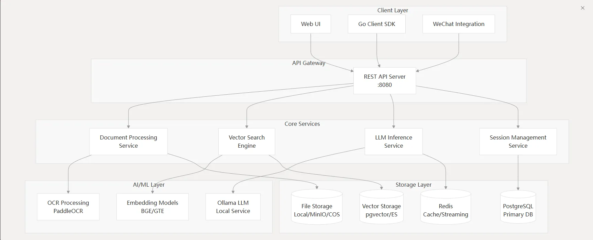
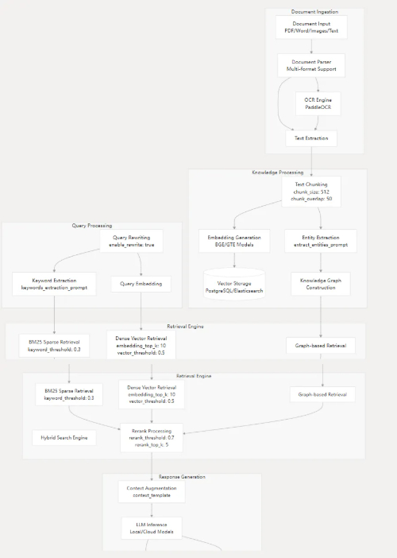

## 소개
WeKnora는 즉시 프로덕션 환경에 투입 가능한 엔터프라이즈급 RAG 프레임워크로, 지능형 문서 이해 및 검색 기능을 구현합니다. 이 시스템은 모듈화 설계를 채택하여 문서 이해, 벡터 저장, 추론 등의 기능을 분리합니다.



---

## PipeLine
WeKnora는 문서를 처리하기 위해 여러 단계를 거칩니다: 삽입 -> 지식 추출 -> 인덱싱 -> 검색 -> 생성. 전체 파이프라인은 다양한 검색 방법을 지원합니다.




사용자가 업로드한 숙박 영수증 PDF 파일을 예시로, 데이터 흐름을 상세히 설명합니다:

### 1. 요청 수신 및 초기화
+ **요청 식별**: 시스템이 요청을 받고, 전체 처리 흐름을 추적하기 위한 고유 `request_id=Lkq0OGLYu2fV`를 할당합니다.
+ **테넌트 및 세션 검증**:
    - 시스템이 먼저 테넌트 정보(ID: 1, Name: Default Tenant)를 검증합니다.
    - 이어서 세션 `1f241340-ae75-40a5-8731-9a3a82e34fdd`에 속하는 지식베이스 QA(Knowledge QA) 요청 처리를 시작합니다.
+ **사용자 질문**: 사용자의 원래 질문은 "**입실한 객실 유형은 무엇인가요**"입니다.
+ **메시지 생성**: 시스템이 사용자 질문과 생성될 답변에 대한 메시지 레코드를 각각 생성하며, ID는 각각 `703ddf09-...`와 `6f057649-...`입니다.

### 2. 지식베이스 QA 프로세스 시작
시스템이 공식적으로 지식베이스 QA 서비스를 호출하고, 순서대로 실행될 완전한 처리 파이프라인(Pipeline)을 정의합니다. 다음 9개의 이벤트를 포함합니다:
`[rewrite_query, preprocess_query, chunk_search, chunk_rerank, chunk_merge, filter_top_k, into_chat_message, chat_completion_stream, stream_filter]`

---

### 3. 이벤트 실행 상세
#### 이벤트 1: `rewrite_query` - 질문 재작성
+ **목적**: 검색을 더 정확하게 하기 위해, 시스템이 컨텍스트를 결합하여 사용자의 실제 의도를 이해해야 합니다.
+ **작업**:
    1. 시스템이 현재 세션의 최근 20개 히스토리 메시지(실제로 8개 검색)를 컨텍스트로 검색합니다.
    2. `deepseek-r1:7b`라는 이름의 로컬 대형 언어 모델을 호출합니다.
    3. 모델이 채팅 히스토리를 분석하여 질문자가 "Liwx"임을 파악하고, 원래 질문 "입실한 객실 유형은 무엇인가요"를 더 구체적으로 재작성합니다.
+ **결과**: 질문이 "**Liwx가 이번에 입실한 객실 유형은 무엇인가요**"로 성공적으로 재작성됩니다.

#### 이벤트 2: `preprocess_query` - 질문 전처리
+ **목적**: 재작성된 질문을 형태소 분석하여 검색 엔진이 처리하기 적합한 키워드 시퀀스로 변환합니다.
+ **작업**: 재작성된 질문에 대해 형태소 분석을 수행합니다.
+ **결과**: 키워드 문자열이 생성됩니다: "`需要 改写 用户 问题 入住 房型 根据 提供 信息 入住 人 Liwx 选择 房型 双床 房 因此 改写 后 完整 问题 为 Liwx 本次 入住 房型`"

#### 이벤트 3: `chunk_search` - 지식 청크 검색
가장 핵심적인 **검색(Retrieval)** 단계로, 시스템이 두 번의 하이브리드 검색(Hybrid Search)을 수행합니다.

+ **첫 번째 검색 (재작성된 전체 문장 사용)**:
    - **벡터 검색**:
        1. 임베딩 모델 `bge-m3:latest`를 로드하여 질문을 1024차원 벡터로 변환합니다.
        2. PostgreSQL 데이터베이스에서 벡터 유사도 검색을 수행하여 2개의 관련 지식 청크(chunk)를 찾습니다. ID는 각각 `e3bf6599-...`와 `3989c6ce-...`입니다.
    - **키워드 검색**:
        1. 동시에 시스템이 키워드 검색도 수행합니다.
        2. 동일한 2개의 지식 청크를 찾습니다.
    - **결과 병합**: 두 방법으로 찾은 4개의 결과(실제로는 2개 중복)가 중복 제거되어 최종적으로 2개의 고유한 지식 청크를 얻습니다.
+ **두 번째 검색 (전처리된 키워드 시퀀스 사용)**:
    - 시스템이 형태소 분석된 키워드를 사용하여 위의 **벡터 검색**과 **키워드 검색** 과정을 반복합니다.
    - 최종적으로 동일한 2개의 지식 청크를 얻습니다.
+ **최종 결과**: 두 번의 검색과 결과 병합을 통해 시스템이 가장 관련성 높은 2개의 지식 청크를 확정하고, 그 내용을 추출하여 답변 생성에 사용할 준비를 합니다.

#### 이벤트 4: `chunk_rerank` - 결과 재정렬
+ **목적**: 더 강력한 모델을 사용하여 초기 검색 결과를 더 세밀하게 정렬함으로써 최종 답변의 품질을 향상시킵니다.
+ **작업**: 로그에 `Rerank model ID is empty, skipping reranking`이 표시됩니다. 이는 시스템이 재정렬 단계를 설정했지만 특정 재정렬 모델을 지정하지 않아 **이 단계를 건너뛰었음**을 의미합니다.

#### 이벤트 5: `chunk_merge` - 청크 병합
+ **목적**: 내용상 인접하거나 관련된 지식 청크를 병합하여 더 완전한 컨텍스트를 형성합니다.
+ **작업**: 시스템이 검색된 2개의 청크를 분석하고 병합을 시도합니다. 로그에 따르면 최종 처리 후에도 2개의 독립적인 청크가 유지되지만, 관련성 점수 순으로 정렬됩니다.

#### 이벤트 6: `filter_top_k` - Top-K 필터링
+ **목적**: 가장 관련성 높은 K개의 결과만 유지하여 너무 많은 관련 없는 정보가 언어 모델을 방해하는 것을 방지합니다.
+ **작업**: 시스템 설정이 상위 5개(Top-K = 5)의 가장 관련성 높은 청크를 유지하도록 구성되어 있습니다. 현재 청크가 2개뿐이므로 모두 이 필터를 통과합니다.

#### 이벤트 7 & 8: `into_chat_message` & `chat_completion_stream` - 답변 생성
이것은 **생성(Generation)** 단계입니다.

+ **목적**: 검색된 정보를 바탕으로 자연스럽고 유창한 답변을 생성합니다.
+ **작업**:
    1. 시스템이 검색된 2개의 지식 청크 내용, 사용자의 원래 질문, 채팅 히스토리를 통합하여 완전한 프롬프트(Prompt)를 형성합니다.
    2. 다시 `deepseek-r1:7b` 대형 언어 모델을 호출하고, **스트리밍(Stream)** 방식으로 답변 생성을 요청합니다. 스트리밍 출력은 타이핑 효과를 구현하여 사용자 경험을 향상시킵니다.

#### 이벤트 9: `stream_filter` - 스트리밍 출력 필터링
+ **목적**: 모델이 생성한 실시간 텍스트 스트림에 대해 후처리를 수행하여 불필요한 특수 마크나 내용을 필터링합니다.
+ **작업**:
    - 시스템이 모델의 사고 과정에서 생성될 수 있는 내부 마크(예: `<think>`와 `</think>`)를 제거하기 위한 필터를 설정합니다.
    - 로그에 따르면 모델이 출력한 첫 번째 토큰은 `<think> 根据`이며, 필터가 성공적으로 `<think>` 마크를 가로채고 제거하여 `根据` 이후의 내용만 전달합니다.

### 4. 완료 및 응답
+ **인용 전송**: 답변 생성과 동시에 시스템이 근거로 삼은 2개의 지식 청크를 "참고 내용"으로 프론트엔드에 전송하여 사용자가 출처를 확인할 수 있도록 합니다.
+ **메시지 업데이트**: 모델이 모든 내용 생성을 완료하면 시스템이 완전한 답변을 이전에 생성된 메시지 레코드(ID: `6f057649-...`)에 업데이트합니다.
+ **요청 종료**: 서버가 `200` 성공 상태 코드를 반환하며, 이번 질문부터 답변까지의 전체 프로세스가 완료됨을 나타냅니다.

### 요약
이 로그는 전형적인 RAG 프로세스를 완전히 기록합니다: 시스템이 **질문 재작성**과 **전처리**를 통해 사용자 의도를 정확히 이해하고, **벡터와 키워드 하이브리드 검색**을 활용하여 지식베이스에서 관련 정보를 찾습니다. 비록 **재정렬**을 건너뛰었지만, **병합**과 **필터링**을 수행한 후 최종적으로 검색된 지식을 컨텍스트로 대형 언어 모델에게 전달하여 자연스럽고 정확한 답변을 **생성**하고, **스트리밍 필터링**을 통해 출력의 순수성을 보장합니다.

## 문서 파싱 및 분할
코드는 gRPC 통신을 통해 독립적인 마이크로서비스를 구현하며, 문서 내용의 심층 파싱, 청킹 및 멀티모달 정보 추출을 전담합니다. 이것이 바로 "비동기 처리" 단계의 핵심 실행자입니다.

### **전체 아키텍처**
이것은 Python 기반의 gRPC 서비스로, 핵심 역할은 파일(또는 URL)을 받아 후속 처리(예: 벡터화)에 사용 가능한 구조화된 텍스트 청크(Chunks)로 파싱하는 것입니다.

+ `server.py`: 서비스의 진입점이자 네트워크 레이어입니다. 멀티 프로세스, 멀티 스레드 gRPC 서버를 시작하여 Go 백엔드의 요청을 받고 파싱 결과를 반환합니다.
+ `parser.py`: 디자인 패턴 중 **퍼사드(Facade) 패턴**입니다. 통합된 `Parser` 클래스를 제공하여 내부의 다양한 구체적인 파서(PDF, DOCX, Markdown 등)의 복잡성을 숨깁니다. 외부 호출자(`server.py`)는 이 `Parser` 클래스와만 상호작용하면 됩니다.
+ `base_parser.py`: 파서의 기본 클래스로, 모든 구체적인 파서가 공유하는 핵심 로직과 추상 메서드를 정의합니다. 이것이 전체 파싱 프로세스의 "두뇌"로, 가장 복잡한 텍스트 청킹, 이미지 처리, OCR 및 이미지 설명 생성 등의 기능을 포함합니다.

---

### **상세 워크플로우**
Go 백엔드가 비동기 작업을 시작할 때, 파일 내용과 설정 정보를 담아 이 Python 서비스에 gRPC 호출을 합니다. 다음은 전체 처리 흐름입니다:

#### **1단계: 요청 수신 및 분배 (**`server.py`** & **`parser.py`**)
1. **gRPC 서비스 진입점 (**`server.py: serve`**)**:
    - 서비스가 `serve()` 함수를 통해 시작됩니다. 환경 변수(`GRPC_WORKER_PROCESSES`, `GRPC_MAX_WORKERS`)에 따라 **멀티 프로세스, 멀티 스레드** 서버를 시작하여 CPU 자원을 충분히 활용하고 동시 처리 능력을 높입니다.
    - 각 워커 프로세스는 지정된 포트(예: 50051)에서 수신 대기하며 요청을 받을 준비를 합니다.
2. **요청 처리 (**`server.py: ReadFromFile`**)**:
    - Go 백엔드가 `ReadFromFile` 요청을 보내면 워커 프로세스 중 하나가 해당 요청을 받습니다.
    - 이 메서드는 먼저 요청의 파라미터를 파싱합니다. 파라미터에는 다음이 포함됩니다:
        * `file_name`, `file_type`, `file_content`: 파일의 기본 정보와 바이너리 내용.
        * `read_config`: `chunk_size`(청크 크기), `chunk_overlap`(중첩 크기), `enable_multimodal`(멀티모달 처리 활성화 여부), `storage_config`(오브젝트 스토리지 설정), `vlm_config`(비전 언어 모델 설정) 등 모든 파싱 설정을 포함하는 복합 객체.
    - 이러한 설정을 `ChunkingConfig` 데이터 객체로 통합합니다.
    - 가장 핵심적인 단계는 `self.parser.parse_file(...)`을 호출하여 파싱 작업을 `Parser` 퍼사드 클래스에 위임하는 것입니다.
3. **파서 선택 (**`parser.py: Parser.parse_file`**)**:
    - `Parser` 클래스가 작업을 받으면 먼저 `get_parser(file_type)` 메서드를 호출합니다.
    - 이 메서드는 파일 유형(예: `'pdf'`)에 따라 딕셔너리 `self.parsers`에서 해당하는 구체적인 파서 클래스(예: `PDFParser`)를 찾습니다.
    - 찾은 후 이 `PDFParser` 클래스를 **인스턴스화**하고 `ChunkingConfig` 등 모든 설정 정보를 생성자에 전달합니다.

#### **2단계: 핵심 파싱 및 청킹 (**`base_parser.py`**)**
전체 흐름의 핵심인 **정보의 컨텍스트 완전성과 원래 순서를 어떻게 보장하는가**에 대한 내용입니다.

`base_parser.py` 코드에 따르면, **최종적으로 분할된 청크의 텍스트, 테이블, 이미지는 원본 문서에서 나타나는 순서대로 저장됩니다**.

이 순서 보장은 주로 `BaseParser`의 몇 가지 정교하게 설계된 메서드들의 상호 협력 덕분입니다. 이 흐름을 자세히 추적해 보겠습니다.

전체 순서 보장은 세 단계로 나눌 수 있습니다:

1. **1단계: 통합 텍스트 스트림 생성 (**`pdf_parser.py`**)**:
    - `parse_into_text` 메서드에서 코드가 PDF를 **페이지 단위**로 처리합니다.
    - 각 페이지 내부에서 특정 로직(비테이블 텍스트 먼저 추출, 테이블 추가, 마지막으로 이미지 플레이스홀더 추가)에 따라 모든 내용을 **하나의 긴 문자열**(`page_content_parts`)로 연결합니다.
    - **핵심**: 이 단계에서 텍스트, 테이블, 이미지 플레이스홀더의 연결 순서가 문자 수준에서 100% 정확하지는 않을 수 있지만, **같은 페이지의 내용이 함께 있고** 대략 위에서 아래로의 읽기 순서를 따르는 것을 보장합니다.
    - 마지막으로 모든 페이지의 내용이 `"\n\n--- Page Break ---\n\n"`으로 연결되어 **모든 정보(텍스트, Markdown 테이블, 이미지 플레이스홀더)를 포함하는 단일하고 순서 있는 텍스트 스트림(**`final_text`**)**이 형성됩니다.
2. **2단계: 원자화 및 보호 (**`_split_into_units`**)**:
    - 이 단일 `final_text`가 `_split_into_units` 메서드에 전달됩니다.
    - 이 메서드는 **구조적 완전성을 보장하는 핵심**입니다. 정규식을 사용하여 **전체 Markdown 테이블**과 **전체 Markdown 이미지 플레이스홀더**를 **분할 불가능한 원자 단위(atomic units)**로 식별합니다.
    - 이러한 원자 단위(테이블, 이미지)와 그 사이의 일반 텍스트 블록을 `final_text`에서 나타나는 **원래 순서**대로 목록(`units`)으로 분할합니다.
    - **결과**: 이제 목록이 생성됩니다. 예를 들어 `['일부 텍스트', '', '다른 텍스트', '|...|...|\n|---|---|\n...', '더 많은 텍스트']`. 이 목록의 요소 순서는 **원본 문서에서의 순서와 완전히 동일**합니다.
3. **3단계: 순서대로 청킹 (**`chunk_text`**)**:
    - `chunk_text` 메서드가 이 **순서 있는 **`units`** 목록**을 받습니다.
    - 작동 방식은 매우 간단명료합니다: 목록의 각 단위(`unit`)를 **순서대로** 순회합니다.
    - 이러한 단위를 임시 `current_chunk` 목록에 **순차적으로 추가**하다가 청크 길이가 `chunk_size` 상한에 가까워지면 멈춥니다.
    - 청크가 가득 차면 저장하고 새로운 청크를 시작합니다(이전 청크의 중첩 부분을 포함할 수 있음).
    - **핵심**: `chunk_text`가 **`units`** 목록의 순서를 **엄격히 따르기** 때문에, 테이블, 텍스트, 이미지 사이의 상대적 순서를 절대 뒤바꾸지 않습니다. 문서에서 먼저 나타나는 테이블은 반드시 더 앞 번호의 청크에 나타납니다.
4. **4단계: 이미지 정보 추가 (**`process_chunks_images`**)**:
    - 텍스트 청크가 분할된 후 `process_chunks_images` 메서드가 호출됩니다.
    - **모든** 이미 생성된 청크를 처리합니다.
    - 각 청크 내부에서 이미지 플레이스홀더를 찾아 AI 처리를 수행합니다.
    - 마지막으로 처리된 이미지 정보(영구 URL, OCR 텍스트, 이미지 설명 등 포함)를 **해당 청크 자체**의 `.images` 속성에 추가합니다.
    - **핵심**: 이 과정은 **청크의 순서나 `.content`의 내용을 변경하지 않습니다**. 이미 존재하는, 올바른 순서의 청크에 추가 정보를 붙이는 것뿐입니다.

#### **3단계: 멀티모달 처리(활성화된 경우) (**`base_parser.py`**)**
`enable_multimodal`이 `True`이면 텍스트 청킹 완료 후 가장 복잡한 멀티모달 처리 단계로 진입합니다.

1. **동시 작업 시작 (**`BaseParser.process_chunks_images`**)**:
    - 이 메서드는 `asyncio`(Python의 비동기 I/O 프레임워크)를 사용하여 **모든 텍스트 청크의 이미지를 동시에 처리**하여 효율성을 크게 향상시킵니다.
    - 각 `Chunk`에 대해 비동기 작업 `process_chunk_images_async`를 생성합니다.
2. **단일 청크의 이미지 처리 (**`BaseParser.process_chunk_images_async`**)**:
    - **이미지 참조 추출**: 먼저 정규식 `extract_images_from_chunk`를 사용하여 현재 청크의 텍스트에서 모든 이미지 참조(예: ``)를 찾습니다.
    - **이미지 영구 저장**: 찾은 각 이미지에 대해 동시에 `download_and_upload_image`를 호출합니다. 이 함수는 다음을 담당합니다:
        * 원래 위치(PDF 내부, 로컬 경로 또는 원격 URL일 수 있음)에서 이미지 데이터를 가져옵니다.
        * 이미지를 **설정된 오브젝트 스토리지(COS/MinIO)에 업로드**합니다. 이 단계가 중요한 이유는 임시적이고 불안정한 이미지 참조를 영구적이고 URL로 공개 접근 가능한 주소로 변환하기 때문입니다.
        * 영구 URL과 이미지 객체(PIL Image)를 반환합니다.
    - **동시 AI 처리**: 성공적으로 업로드된 모든 이미지를 수집하여 `process_multiple_images`를 호출합니다.
        * 이 메서드는 내부적으로 `asyncio.Semaphore`를 사용하여 동시 처리 수를 제한(예: 최대 5개 동시 처리)하여 순간적인 메모리 과소비나 모델 API 속도 제한 트리거를 방지합니다.
        * 각 이미지에 대해 `process_image_async`를 호출합니다.
3. **단일 이미지 처리 (**`BaseParser.process_image_async`**)**:
    - **OCR**: `perform_ocr`을 호출하여 OCR 엔진(예: `PaddleOCR`)으로 이미지의 모든 텍스트를 인식합니다.
    - **이미지 설명(Caption)**: `get_image_caption`을 호출하여 이미지 데이터(Base64로 변환)를 설정된 비전 언어 모델(VLM)에 전송하고 이미지 내용에 대한 자연어 설명을 생성합니다.
    - 이 메서드는 `(ocr_text, caption, 영구URL)`을 반환합니다.
4. **결과 집계**:
    - 모든 이미지 처리가 완료되면 영구 URL, OCR 텍스트, 이미지 설명을 포함한 구조화된 정보가 해당 `Chunk` 객체의 `.images` 필드에 추가됩니다.

#### **4단계: 결과 반환 (**`server.py`**)**
1. **데이터 변환 (**`server.py: _convert_chunk_to_proto`**)**:
    - `parser.parse_file`이 완료되면 처리된 모든 `Chunk` 객체의 목록(`ParseResult`)을 반환합니다.
    - `ReadFromFile` 메서드가 이 결과를 받아 `_convert_chunk_to_proto`를 호출하여 Python의 `Chunk` 객체(내부 이미지 정보 포함)를 gRPC로 정의된 Protobuf 메시지 형식으로 변환합니다.
2. **응답 반환**:
    - 마지막으로 gRPC 서버가 모든 청크와 멀티모달 정보를 포함한 `ReadResponse` 메시지를 호출자인 Go 백엔드 서비스에 전송합니다.

여기서 Go 백엔드는 구조화되고 정보가 풍부한 문서 데이터를 받아 다음 단계인 벡터화 및 인덱스 저장을 진행할 수 있습니다.


## 배포
Docker 이미지를 통한 로컬 배포를 지원하며 API 포트를 통해 인터페이스 서비스를 제공합니다.

## 성능 및 모니터링
Weknora는 풍부한 모니터링 및 테스트 컴포넌트를 포함합니다:

+ 분산 추적: Jaeger를 통합하여 서비스 아키텍처에서 요청의 전체 실행 경로를 추적합니다. 본질적으로 Jaeger는 사용자가 분산 시스템에서 요청의 전체 생명주기를 "볼 수" 있게 도와주는 기술입니다.
+ 헬스 모니터링: 서비스가 정상 상태에 있는지 모니터링합니다.
+ 확장성: 컨테이너화 배포를 통해 여러 서비스로 대규모 동시 요청을 처리할 수 있습니다.

## QA
### 질문 1: 검색 과정에서 두 번의 하이브리드 검색을 수행하는 목적은 무엇인가요? 첫 번째와 두 번째 검색의 차이는 무엇인가요?
이것은 매우 좋은 관찰입니다. 시스템이 두 번의 하이브리드 검색을 수행하는 것은 **검색의 정확도와 재현율을 최대화**하기 위한 것으로, 본질적으로 **쿼리 확장(Query Expansion)과 다중 전략 검색**의 조합 방법입니다.

#### 목적
두 가지 다른 형태의 쿼리(원래 재작성된 문장 vs. 형태소 분석된 키워드 시퀀스)로 검색함으로써 시스템이 두 가지 쿼리 방식의 장점을 결합할 수 있습니다:

+ **시맨틱 검색의 깊이**: 완전한 문장으로 검색하면 벡터 모델(예: `bge-m3`)이 문장 전체 의미를 이해하는 능력을 더 잘 활용하여 의미적으로 가장 가까운 지식 청크를 찾을 수 있습니다.
+ **키워드 검색의 폭**: 형태소 분석된 키워드로 검색하면 지식 청크의 표현 방식이 원래 질문과 다르더라도 핵심 키워드만 포함하고 있으면 검색될 수 있습니다. 이것은 전통적인 키워드 매칭 알고리즘(예: BM25)에 특히 효과적입니다.

간단히 말하면, **두 가지 다른 "질문 방식"으로 같은 질문을 하고** 양쪽의 결과를 합산하여 가장 관련성 높은 지식이 누락되지 않도록 하는 것입니다.

#### 두 번의 검색의 차이점
가장 핵심적인 차이는 **입력 쿼리 텍스트(Query Text)**입니다:

1. **첫 번째 하이브리드 검색**
    - **입력**: `rewrite_query` 이벤트 후 생성된 **문법적으로 완전한 자연어 문장**을 사용합니다.
    - **로그 증거**:

```plain
INFO [2025-08-29 09:46:36.896] [request_id=Lkq0OGLYu2fV] knowledgebase.go:266[HybridSearch] | Hybrid search parameters, knowledge base ID: kb-00000001, query text: 需要改写的用户问题是："入住的房型是什么"。根据提供的信息，入住人Liwx选择的房型是双床房。因此，改写后的完整问题为： "Liwx本次入住的房型是什么"
```

2. **두 번째 하이브리드 검색**
    - **입력**: `preprocess_query` 이벤트 처리 후 생성된 **공백으로 구분된 키워드 시퀀스**를 사용합니다.
    - **로그 증거**:

```plain
INFO [2025-08-29 09:46:37.257] [request_id=Lkq0OGLYu2fV] knowledgebase.go:266[HybridSearch] | Hybrid search parameters, knowledge base ID: kb-00000001, query text: 需要 改写 用户 问题 入住 房型 根据 提供 信息 入住 人 Liwx 选择 房型 双床 房 因此 改写 后 完整 问题 为 Liwx 本次 入住 房型
```

최종적으로 시스템이 두 번의 검색 결과를 중복 제거하고 병합(로그에서 각 검색마다 2개의 결과를 찾고 중복 제거 후 총 2개)하여 더 신뢰할 수 있는 지식 집합을 얻어 이후의 답변 생성에 사용합니다.


### 질문 2: 재정렬 모델 분석
Reranker(재정렬기)는 현재 RAG 분야에서 매우 발전된 기술로, 작동 원리와 적용 시나리오에서 눈에 띄는 차이가 있습니다.

간단히 말하면, 이들은 "**전문적인 판별 모델**"에서 "**대형 언어 모델(LLM)을 이용한 판별**"로, 다시 "**LLM 내부 정보를 심층 탐구하여 판별**"로 발전하는 과정을 대표합니다.

다음은 자세한 차이점입니다:


#### 1. Normal Reranker (일반 재정렬기 / 교차 인코더)
가장 고전적이고 주류인 재정렬 방법입니다.

+ **모델 유형**: **시퀀스 분류 모델(Sequence Classification Model)**. 본질적으로 **교차 인코더(Cross-Encoder)**로, 일반적으로 BERT, RoBERTa 등 양방향 인코더 아키텍처를 기반으로 합니다. `BAAI/bge-reranker-base/large/v2-m3`이 모두 이 범주에 속합니다.
+ **작동 원리**:
    1. **쿼리(Query)**와 **정렬할 문서(Passage)**를 단일 입력 시퀀스로 연결합니다. 예: `[CLS] what is panda? [SEP] The giant panda is a bear species endemic to China. [SEP]`.
    2. 이 연결된 시퀀스가 완전히 모델에 입력됩니다. 모델 내부의 자기 주의 메커니즘(Self-Attention)이 쿼리와 문서의 모든 단어를 동시에 분석하고 그 사이의 **세밀한 상호작용 관계**를 계산합니다.
    3. 모델이 최종적으로 **단일 점수(Logit)**를 출력하며, 이 점수가 쿼리와 문서의 관련성을 직접 나타냅니다. 점수가 높을수록 관련성이 높습니다.
+ **주요 특성**:
    - **장점**: 쿼리와 문서가 모델 내부에서 충분하고 심층적으로 상호작용하기 때문에 **정확도가 일반적으로 매우 높으며**, Reranker 성능의 황금 표준입니다.
    - **단점**: **속도가 느립니다**. **모든 "쿼리-문서" 쌍**에 대해 독립적으로 비용이 많이 드는 완전한 계산을 실행해야 하기 때문입니다. 초기 검색이 100개의 문서를 반환하면 100번 실행해야 합니다.


#### 2. LLM-based Reranker (LLM 기반 재정렬기)
이 방법은 창의적으로 범용 대형 언어 모델(LLM)의 능력을 재정렬에 활용합니다.

+ **모델 유형**: **인과 언어 모델(Causal Language Model)**, 즉 GPT, Llama, Gemma처럼 텍스트 생성에 사용되는 LLM. `BAAI/bge-reranker-v2-gemma`가 전형적인 예입니다.
+ **작동 원리**:
    1. **점수를 직접 출력하는 것이 아니라** 재정렬 작업을 **질문-답변 또는 텍스트 생성 작업으로 변환**합니다.
    2. 정교하게 설계된 **프롬프트(Prompt)**를 통해 입력을 구성합니다. 예: `"Given a query A and a passage B, determine whether the passage contains an answer to the query by providing a prediction of either 'Yes' or 'No'. A: {query} B: {passage}"`.
    3. 이 완전한 Prompt를 LLM에 입력하고 **LLM이 마지막에 "Yes"라는 단어를 생성할 확률을 관찰**합니다.
    4. 이 **"Yes" 생성 확률(또는 Logit 값)이 관련성 점수로 사용**됩니다. 모델이 답이 "Yes"라고 매우 확신한다면 문서 B가 쿼리 A의 답을 포함한다고 판단하여 관련성이 높음을 나타냅니다.
+ **주요 특성**:
    - **장점**: LLM의 강력한 **의미 이해, 추론 및 세계 지식**을 활용할 수 있으며, 깊은 이해와 추론이 필요한 복잡한 쿼리에서 더 나은 효과를 보일 수 있습니다.
    - **단점**: 계산 비용이 매우 클 수 있으며(LLM 크기에 따라 다름), 성능이 **Prompt 설계에 크게 의존**합니다.


#### 3. LLM-based Layerwise Reranker (LLM 레이어별 정보 기반 재정렬기)
두 번째 방법의 "강화 버전"으로, 더 첨단적이고 복잡한 탐구적 기술입니다.

+ **모델 유형**: 마찬가지로 **인과 언어 모델(Causal Language Model)**. 예를 들어 `BAAI/bge-reranker-v2-minicpm-layerwise`.
+ **작동 원리**:
    1. 입력 부분은 두 번째 방법과 완전히 동일하며, "Yes/No" Prompt를 사용합니다.
    2. 핵심 차이는 **점수 추출 방식**입니다. LLM의 **마지막 레이어**의 출력(즉, 최종 예측 결과)에만 의존하지 않습니다.
    3. LLM이 레이어별로 정보를 처리하는 과정에서 다른 깊이의 네트워크 레이어(Layer)가 다른 수준의 시맨틱 관련성 정보를 포착할 수 있다고 봅니다. 따라서 **모델의 여러 중간 레이어**에서 "Yes"라는 단어의 예측 Logit을 추출합니다.
    4. 코드의 `cutoff_layers=[28]` 파라미터는 모델에게 "28번째 레이어의 출력을 주세요"라고 알려줍니다. 최종적으로 다른 네트워크 레이어에서 나온 하나 이상의 점수를 얻으며, 이 점수들을 평균이나 다른 방식으로 조합하여 더 견고한 최종 관련성 판단을 형성할 수 있습니다.
+ **주요 특성**:
    - **장점**: 이론적으로 **더 풍부하고 포괄적인 관련성 신호**를 얻을 수 있으며, 마지막 레이어만 보는 것보다 높은 정확도를 달성할 수 있어 현재 성능의 극한을 탐구하는 방법 중 하나입니다.
    - **단점**: **복잡도가 가장 높으며**, 중간 레이어 정보를 추출하기 위해 모델을 특별히 수정해야 하고(코드의 `trust_remote_code=True`가 그 신호), 계산 비용도 매우 큽니다.

#### 종합 비교
| 특성 | 1. Normal Reranker (일반) | 2. LLM-based Reranker (LLM 기반) | 3. LLM-based Layerwise Reranker (LLM 레이어별) |
| :--- | :--- | :--- | :--- |
| **기반 모델** | 교차 인코더 (예: BERT) | 인과 언어 모델 (예: Gemma) | 인과 언어 모델 (예: MiniCPM) |
| **작동 원리** | Query와 Passage의 심층 상호작용 계산, 직접 관련성 점수 출력 | 정렬 작업을 "Yes/No" 예측으로 변환, "Yes" 확률을 점수로 사용 | 2번과 유사하지만 LLM의 여러 중간 레이어에서 "Yes" 확률 추출 |
| **출력** | 단일 관련성 점수 | 단일 관련성 점수 (마지막 레이어 기반) | 여러 관련성 점수 (다른 레이어 기반) |
| **장점** | **속도와 정확도의 최적 균형점**, 성숙하고 안정적 | LLM의 추론 능력 활용, 복잡한 문제 처리 | 이론적으로 정확도 최고, 신호가 더 풍부 |
| **단점** | 벡터 검색보다 느림 | 계산 비용 큼, Prompt 설계에 의존 | **복잡도 최고**, 계산 비용 최대 |
| **추천 시나리오** | **대부분의 프로덕션 환경에서 첫 번째 선택**, 효과 좋고 배포 용이 | 답변 품질에 극도의 요구가 있고 계산 자원이 충분한 시나리오 | 학술 연구 또는 SOTA(State-of-the-art) 성능을 추구하는 시나리오 |


#### 사용 권장사항
1. **시작 단계**: **`Normal Reranker`부터 시작**하는 것을 강력히 권장합니다. 예를 들어 `BAAI/bge-reranker-v2-m3`. 현재 종합 성능이 가장 좋은 모델 중 하나로, RAG 시스템 성능을 크게 향상시킬 수 있으며 통합 및 배포가 상대적으로 쉽습니다.
2. **심화 탐구**: 일반 Reranker가 매우 미묘하거나 복잡한 추론이 필요한 쿼리 처리에서 성능이 부족하고 충분한 GPU 자원이 있다면 `LLM-based Reranker`를 시도해볼 수 있습니다.
3. **최신 연구**: `Layerwise Reranker`는 연구자나 특정 작업에서 마지막 성능을 끌어내려는 전문가에게 더 적합합니다.


### 질문 3: 거친 필터링 또는 세밀한 필터링(재정렬 포함) 후 지식을 어떻게 조합하여 대형 모델에 전송하나요?
이 부분은 주로 프롬프트 설계에 관한 것입니다. 전형적인 지시 세부 사항으로, 핵심 작업은 컨텍스트를 기반으로 사용자 질문에 답하는 것입니다. 컨텍스트 조합 시 다음을 지정해야 합니다.
핵심 제약: 반드시 제공된 문서에 엄격히 따라 답변해야 하며, 자신의 지식으로 답하는 것은 금지됩니다.
알 수 없는 경우 처리: 문서에 질문에 답하기에 충분한 정보가 없는 경우 "보유한 자료에 따르면 이 질문에 답할 수 없습니다"라고 알려주세요.
인용 요구: 답변 시 특정 문서 내용을 인용한 경우 문장 끝에 문서 번호를 추가해주세요.

---

## 수동 지식 온라인 편집

플랫폼 지식베이스 페이지에 "문서 업로드 / 온라인 편집" 이중 입구가 추가되어 브라우저에서 직접 Markdown 지식을 작성하고 유지관리할 수 있습니다:

- 초안 모드는 내용을 임시 저장하는 데 사용되며, 초안은 검색에 참여하지 않습니다.
- 발행 작업은 자동으로 벡터화와 인덱스 구축을 트리거합니다.
- 이미 발행된 Markdown 지식은 다시 열어 편집하고 재발행할 수 있습니다.
- 대화 페이지의 어시스턴트 답변 끝에 "지식베이스에 추가" 도구가 제공되어 현재 질문-답변 내용을 원클릭으로 편집기에 가져와 확인 후 저장할 수 있습니다.
